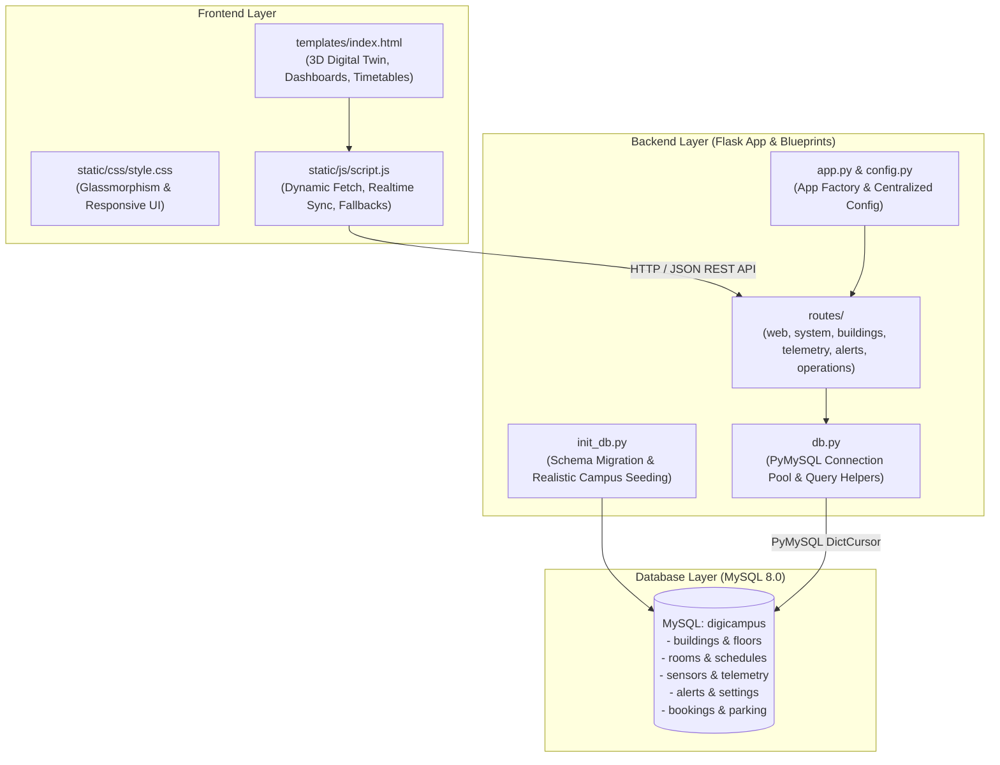

# Campus Digital Twin - Full Stack Integration (Flask + MySQL)

A real-time **Campus Digital Twin** web application featuring interactive 3D campus visualization, room scheduling timetables, live IoT telemetry, energy analytics, alert queues, and administrative preferences backed by a **Python Flask REST API** and a **MySQL** database.

---

## 🏗 System Architecture



---

## 📁 Project Structure

```text
digitwin/
├── templates/
│   └── index.html          # Campus Digital Twin Jinja2 frontend template
├── static/
│   ├── css/
│   │   └── style.css       # Modern styling, animations, and responsive layout
│   └── js/
│       └── script.js       # Client-side logic & reactive MySQL backend sync
├── routes/
│   ├── __init__.py         # Blueprint registration hub
│   ├── web.py              # Frontend view routes (render_template)
│   ├── system.py           # Health check and campus overview stats APIs
│   ├── buildings.py        # Buildings, rooms, timetables, and 3D twin APIs
│   ├── telemetry.py        # Energy, occupancy, and IoT sensor APIs
│   ├── alerts.py           # Alert queue, dismiss, and resolve APIs
│   └── operations.py       # Settings, bookings, and parking APIs
├── app.py                  # Flask Application Factory & server entry point
├── config.py               # Centralized environment configuration
├── db.py                   # PyMySQL database connection manager & query helpers
├── init_db.py              # Database schema creation & initial data seeding
├── requirements.txt        # Python dependencies (Flask, PyMySQL, python-dotenv, etc.)
├── .env                    # Active database & server configuration
├── .env.example            # Environment variable template
├── .gitignore              # Git ignore rules
└── README.md               # Documentation and API guide
```

---

## 🚀 Quick Start Guide

### 1. Requirements
- **Python 3.9+** (Flask, PyMySQL)
- **MySQL 8.0+** or **MariaDB** (or Docker)

### 2. Start MySQL
If using the local Docker MySQL container:
```bash
docker start digicampus-mysql
```
Or start your local MySQL service:
```bash
sudo systemctl start mysql
```

### 3. Configure Database Credentials
Verify or modify [.env](file:///home/shubh/digitwin/.env):
```ini
DB_HOST=127.0.0.1
DB_PORT=3306
DB_USER=digiuser
DB_PASSWORD=digipass
DB_NAME=digicampus

FLASK_HOST=0.0.0.0
FLASK_PORT=5000
FLASK_DEBUG=True
```

### 4. Initialize & Seed the MySQL Database
Run the automated schema creator and seeder:
```bash
python3 init_db.py
```
*Creates all tables (`buildings`, `rooms`, `schedules`, `sensors`, `alerts`, `dashboard_settings`, etc.) and seeds initial campus blocks, schedules, and IoT sensors.*

### 5. Start the Flask Backend Server
```bash
python3 app.py
```
Open your browser at: **[http://localhost:5000](http://localhost:5000)**

---

## 📡 REST API Reference

| Method | Endpoint | Description |
|---|---|---|
| `GET` | `/api/health` | Service status & MySQL connectivity verification |
| `GET` | `/api/stats` | Campus headline stats (buildings, occupancy, energy, coverage) |
| `GET` | `/api/buildings` | All campus buildings with metadata and 3D twin mappings |
| `GET` | `/api/buildings/<id_or_name>/rooms` | Rooms for a building with capacity and schedule counts |
| `GET` | `/api/rooms/<bld>/<room>/timetable` | Scheduled class timetable for a room |
| `GET` | `/api/all-rooms-data` | Complete room timetables hierarchy |
| `GET` | `/api/energy` | Energy metrics, solar generation, and weekly charts |
| `GET` | `/api/occupancy` | Occupancy counters and building breakdown |
| `GET` | `/api/sensors` | Supported IoT sensor readings and health counts |
| `POST` | `/api/sensors/refresh` | Trigger sensor telemetry refresh cycle |
| `GET` | `/api/alerts` | Active, resolved, and dismissed alert history |
| `POST` | `/api/alerts/<id>/dismiss` | Mark an alert as dismissed in MySQL |
| `POST` | `/api/alerts/<id>/resolve` | Mark an alert as resolved in MySQL |
| `POST` | `/api/alerts` | Create a new campus alert in MySQL |
| `GET` | `/api/settings` | Retrieve dashboard configuration from MySQL |
| `POST` | `/api/settings` | Save dashboard configuration into MySQL |
| `GET` | `/api/bookings` | Retrieve room reservations |
| `POST` | `/api/bookings` | Book a room |
| `GET` | `/api/parking` | Parking zone occupancy and slots |

---

## 💡 Frontend Features Integrated with MySQL

1. **Top Navbar Status Badge**:
   - Displays real-time `🟢 MySQL Connected` when connected to Flask and MySQL.
   - Automatically detects whether accessed directly via `http://localhost:5000` or a separate dev server (e.g. VS Code Live Server on port 5500).

2. **3D Campus Digital Twin**:
   - Clicking buildings shows popups populated directly from the MySQL `buildings` table.

3. **Room Exploration & Class Timetables**:
   - Clicking **"View Rooms"** for any Block loads rooms dynamically from MySQL.
   - Selecting a room displays today's class schedule directly from `schedules`.

4. **Live Sensor Monitoring**:
   - Supported sensor types (Temperature, Occupancy, Energy, Air Quality, Door, Humidity) synced with MySQL.
   - Clicking **"Live Data ▾"** triggers sensor telemetry refresh and updates MySQL timestamps.

5. **Campus Alerts**:
   - Alerts stored in MySQL.
   - Clicking **"Dismiss"** or **"Resolve"** updates the record in MySQL in real time.

6. **Dashboard Settings**:
   - Settings (refresh interval, live data toggle, density, default landing page) loaded from MySQL.
   - Clicking **"Save Settings"** persists configurations directly to the MySQL `dashboard_settings` table.
   - Dark Mode applies immediately and persists in this browser, with optional MySQL synchronization.
